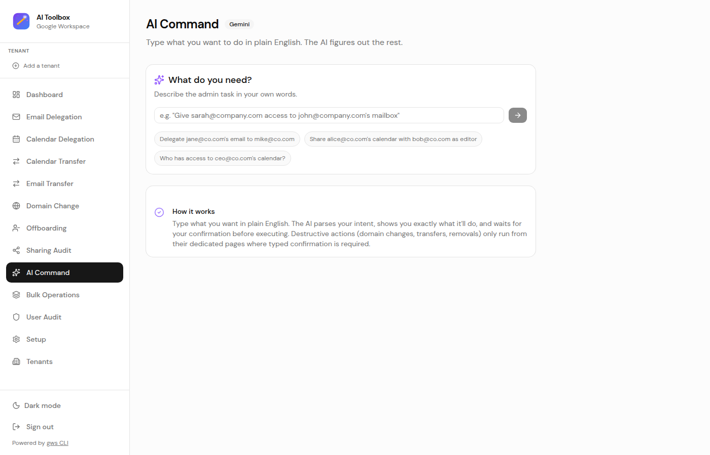
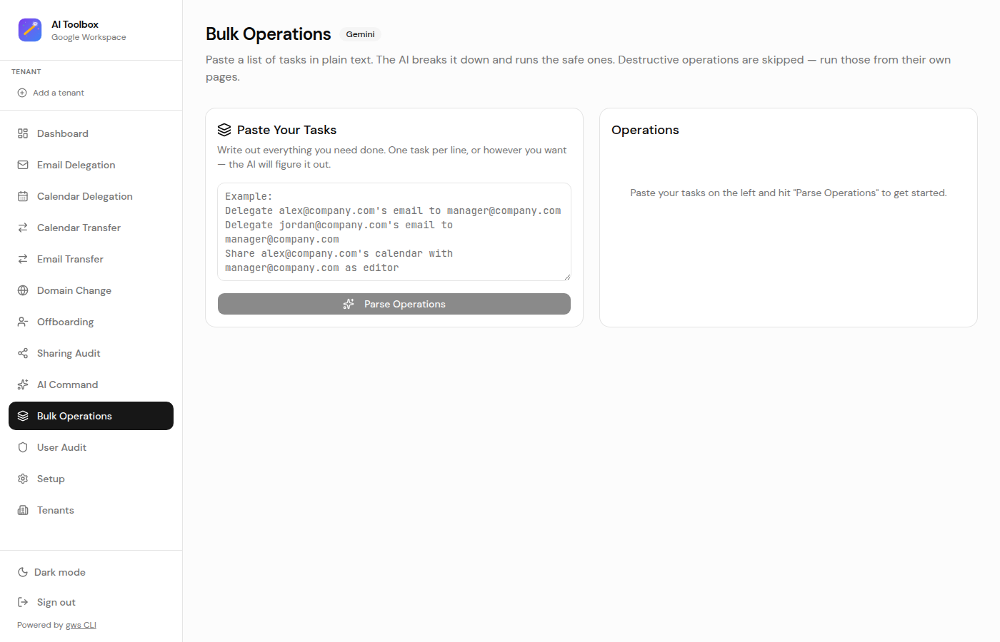

<p align="left">
  
</p>

<h1 align="left">Google Workspace AI Toolbox</h1>

<p align="left">
  <strong>If you grew up on <a href="https://github.com/GAM-team/GAM">GAM</a>, this is what comes next.</strong><br/>
  A modern web UI for Google Workspace admin tasks — powered by Google's official <a href="https://github.com/googleworkspace/cli">Workspace CLI</a> and Gemini AI.
</p>

For years, [GAM](https://github.com/GAM-team/GAM) was *the* tool every Workspace admin had in their back pocket. It's a legend. But now Google has released their own [Workspace CLI](https://github.com/googleworkspace/cli) (`gws`) — built in Rust, schema-driven, officially maintained — and suddenly we've got a proper foundation to build on.

This project takes `gws` and wraps it in a clean web UI with AI superpowers. Instead of memorizing command flags or digging through the Admin Console, just type what you need in plain English, paste a bulk list, or click through the forms. It's GAM for the AI era.


## ✨ What it does

### Workspace operations

- 📧 **Email Delegation** — Give someone access to another user's mailbox. No password sharing, no drama.
- 📅 **Calendar Delegation** — Share a calendar with configurable permissions (free/busy, read, edit, full control).
- 🔄 **Calendar Transfer** — Hand off calendar ownership to another user. Great for offboarding.
- 📬 **Email Transfer** — Set up auto-forwarding from one mailbox to another. External-domain transfers require explicit confirmation.
- 🌐 **Domain Change** — Switch a user's primary email to a different domain in your tenant. Server-side preflight + read-after-write verification.
- 👋 **Offboarding** — One screen, one click. Vacation responder, mail forwarding, calendar + Drive ownership transfer, OAuth token revocation, sign-out, and account suspension — in the right order, with full diff preview before anything fires.
- 🔍 **External Sharing Audit** — Per-user or tenant-wide Drive scan that surfaces every file shared outside your verified domains, including link-shared / "anyone with link" content. Cancellable, progress-tracked, CSV export for remediation.
- 🏢 **Multi-Tenant Support** — Configure multiple Google Workspace environments (Production, Sandbox, etc.) and switch between them instantly from the sidebar. Per-request tenant isolation — nothing carries over between tenants.

### AI-powered (Gemini)

- ✨ **AI Command** — Type what you need in plain English. *"Give sarah access to john's mailbox"* → it parses the intent, validates the params, shows you what it'll do, and waits for your OK.
- 📋 **Bulk Operations** — Paste a list of tasks (one per line, however you want) and the AI breaks them into individual operations you can run all at once, with per-row status.
- 🛡️ **User Audit** — Enter a user's email and get a full AI-generated report: who has access to their mailbox, calendar sharing rules, forwarding config, and security flags.

### Safety & ops

- 🔐 **Password gate + signed sessions** — App refuses to serve any route without `APP_PASSWORD` set. HMAC-signed session cookies, 12h TTL, rate-limited login.
- 🛡️ **CSRF protection** — Same-origin Origin/Referer check on every mutating API route, validated against the canonical request host.
- ⚠️ **Confirmation dialogs** — Every destructive action (domain change, calendar transfer, external email transfer, offboarding, account suspension) shows a before→after diff and requires you to type the target email/identifier to confirm.
- 📜 **Audit log** — Append-only JSON-lines log of every mutation, with secrets redacted (`AUDIT_LOG_PATH` env var to control location).
- 🧪 **Atomic tenant config writes** — `tenants.json` is written via tmp-file + rename with an in-process mutex so a crash mid-write can't corrupt your config.

<details>
<summary>📸 More screenshots</summary>

### AI Command


### Bulk Operations


### User Audit


### Email Delegation


### Calendar Delegation


### Calendar Transfer


### Email Transfer


### Domain Change


### Offboarding


### External Sharing Audit


### Tenants


### Setup


</details>

## 🚀 Getting started

You'll need:
- Node.js 18+
- The [gws CLI](https://github.com/googleworkspace/cli)
- A Google Workspace admin account

```bash
# Grab the gws CLI
npm install -g @googleworkspace/cli

# Auth up (easiest way, needs gcloud)
gws auth setup

# Or do it manually
gws auth login -s gmail,calendar

# Then run this thing
git clone https://github.com/Michael-Civitillo/google-workspace-ai-toolbox.git
cd google-workspace-ai-toolbox
npm install

# Required: set the password gate before starting the server
export APP_PASSWORD='something-long-and-random'

npm run dev
```

Hit [http://localhost:3000](http://localhost:3000), log in with your `APP_PASSWORD`, and you're in. 🎉

## 🔐 Auth setup (the important part)

The app runs `gws` commands and `googleapis` SDK calls on the server side. For real admin work, you'll want a **service account with domain-wide delegation** so you can act on behalf of any user in your org:

1. Create a service account in your GCP project
2. Turn on domain-wide delegation in the Admin Console
3. Add these OAuth scopes:
   - `https://www.googleapis.com/auth/gmail.settings.sharing`
   - `https://www.googleapis.com/auth/gmail.settings.basic`
   - `https://www.googleapis.com/auth/calendar`
   - `https://www.googleapis.com/auth/admin.directory.user` (Domain Change, Offboarding)
   - `https://www.googleapis.com/auth/admin.directory.user.security` (Offboarding — OAuth token revoke, sign-out)
   - `https://www.googleapis.com/auth/admin.directory.domain.readonly` (Domain Change, Sharing Audit)
   - `https://www.googleapis.com/auth/admin.datatransfer` (Offboarding — Drive ownership transfer)
   - `https://www.googleapis.com/auth/drive.metadata.readonly` (Sharing Audit)
4. Set an admin email for impersonation (Domain Change and Admin SDK calls need this):
   ```bash
   export GOOGLE_WORKSPACE_ADMIN_EMAIL=admin@yourdomain.com
   ```
5. Tell the CLI where to find your service account JSON:
   ```bash
   export GOOGLE_WORKSPACE_CLI_CREDENTIALS_FILE=/path/to/service-account.json
   ```

For the AI features, you'll also need a [Gemini API key](https://aistudio.google.com/apikey):
```bash
export GOOGLE_GENERATIVE_AI_API_KEY=your-key-here
```

> **Tip:** If you're using multi-tenant support, set credentials per tenant directly in the UI instead of relying on env vars.

## 🔒 Production deployment

The toolbox is designed to be safe to run against a real tenant, but a few env vars matter:

| Variable | Required | What it does |
|---|---|---|
| `APP_PASSWORD` | ✅ | Password gate. App refuses to serve any route without it. |
| `GOOGLE_WORKSPACE_ADMIN_EMAIL` | ✅ for Admin SDK ops | Subject for service account impersonation. |
| `GOOGLE_WORKSPACE_CLI_CREDENTIALS_FILE` | ⚠️ if not using per-tenant config | Path to service account JSON. |
| `GOOGLE_GENERATIVE_AI_API_KEY` | ⚠️ for AI features | Gemini API key. |
| `AUDIT_LOG_PATH` | optional | Override location of the append-only audit log (defaults to `./audit.log`). |
| `GWS_CREDENTIALS_DIR` | optional | Allowlist a directory; tenant credential paths must live underneath it. |

Run behind HTTPS in production. The app sets HSTS, X-Frame-Options, X-Content-Type-Options, and Referrer-Policy on every response.

## 🏢 Multiple tenants (Production, Sandbox, etc.)

Got more than one Workspace environment? Go to **Tenants** in the sidebar and add each one with its own service account and admin email. The active tenant is always visible in the sidebar — switch between them with one click.

Each tenant is fully isolated: every command, delegation, audit, and transfer targets whichever tenant is active at the time. The active tenant ID is sent on every request via an `x-tenant-id` header and frozen at confirmation time, so a tenant switch mid-action can't accidentally fire against the wrong environment.

Tenant config is saved to `tenants.json` locally (gitignored — your credential paths stay on your machine).

## 🧰 Built with

- [Next.js](https://nextjs.org/) 16 (App Router)
- [Tailwind CSS](https://tailwindcss.com/) v4
- [shadcn/ui](https://ui.shadcn.com/) + [@base-ui/react](https://base-ui.com/)
- [Vercel AI SDK](https://sdk.vercel.ai/) + [Gemini](https://ai.google.dev/)
- [googleapis](https://www.npmjs.com/package/googleapis) (Admin SDK, Drive, Data Transfer)
- [gws CLI](https://github.com/googleworkspace/cli)
- Web Crypto API (Edge-runtime safe HMAC sessions)

## 💻 Dev stuff

```bash
npm run dev          # fire it up
npm run build        # production build
npm run lint         # check your work
npm run screenshots  # regenerate docs/screenshots/* (needs dev server running + APP_PASSWORD set)
```

## ⚠️ Heads up

This tool makes real changes to real Google Workspace accounts. Mistakes can lock people out, break email routing, or cause other headaches that are annoying to undo. Use it carefully, test in a sandbox first, and make sure whoever's running it knows what they're doing.

**This is provided as-is. No warranty, no guarantees, not my problem if something goes wrong.** You're responsible for what you do with it.

## 📄 License

MIT — do whatever you want with it.
