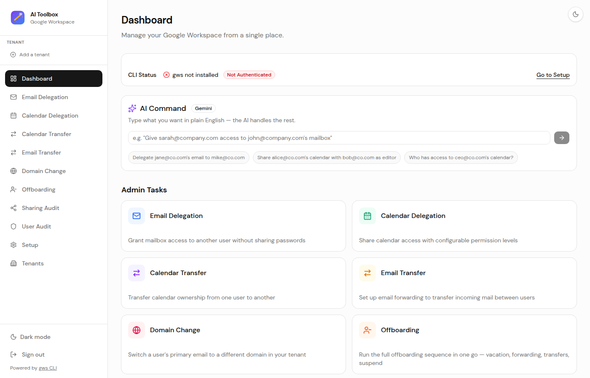
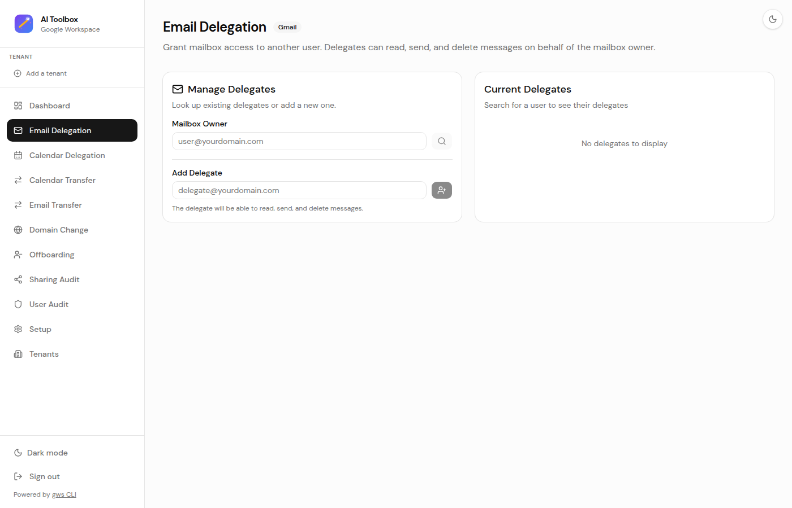
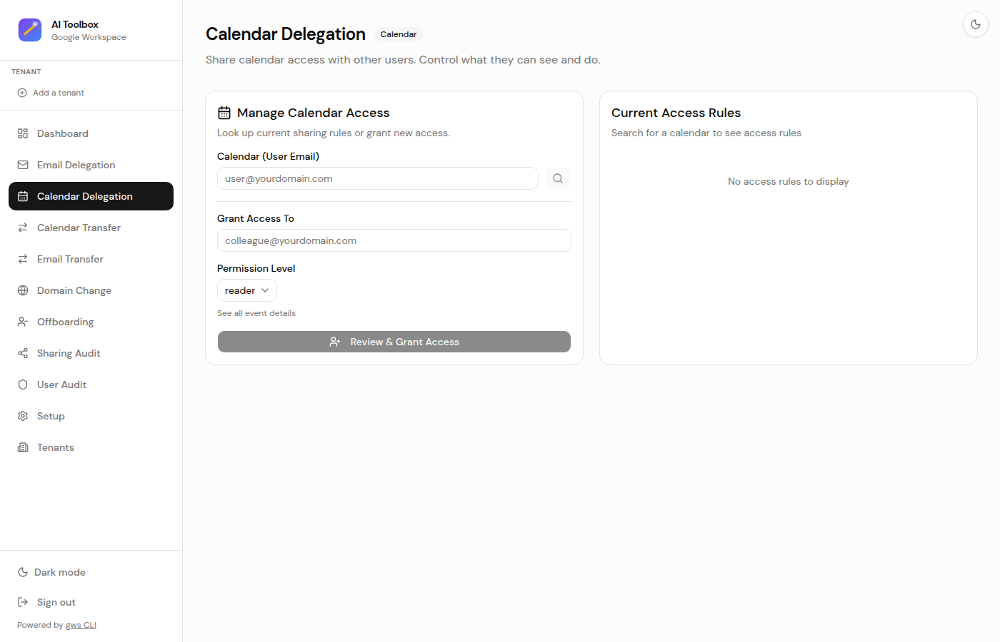
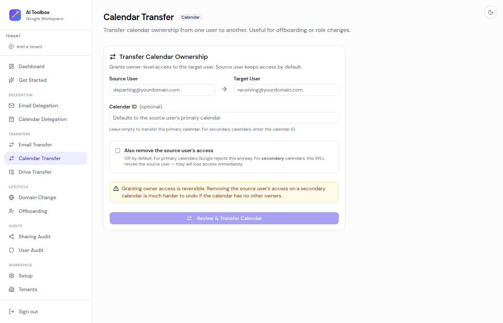
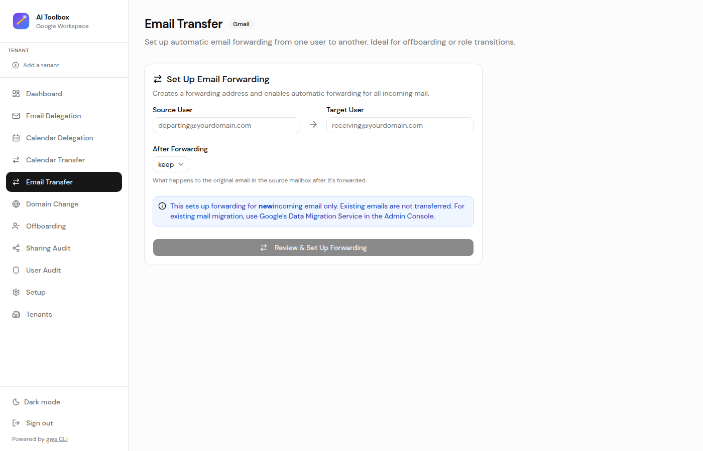
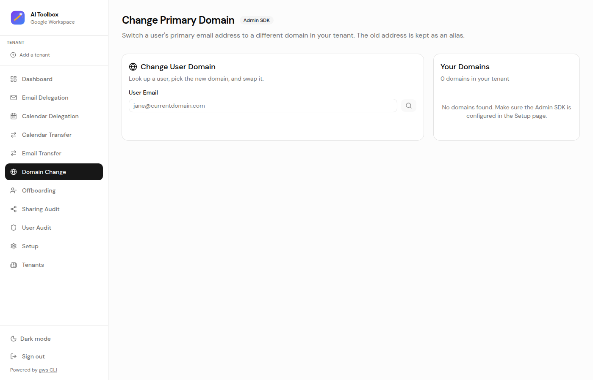
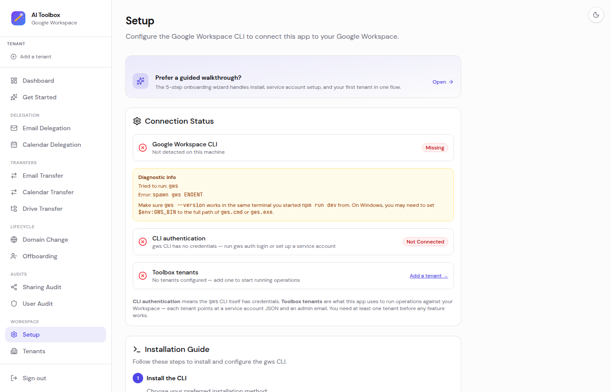

# 🧰 Google Workspace AI Toolbox

I got tired of clicking through the Google Admin Console for the same handful of tasks every week. So I built this.

It's a simple web app that wraps the [Google Workspace CLI](https://github.com/googleworkspace/cli) (`gws`) with a clean UI. No more hunting through menus to delegate a mailbox or share a calendar — just pick the task, fill in the emails, and go.



## ✨ What it does

- 📧 **Email Delegation** — Give someone access to another user's mailbox. No password sharing, no drama.
- 📅 **Calendar Delegation** — Share a calendar with configurable permissions (free/busy, read, edit, full control).
- 🔄 **Calendar Transfer** — Hand off calendar ownership to another user. Great for offboarding.
- 📬 **Email Transfer** — Set up auto-forwarding from one mailbox to another. Also great for offboarding.
- 🌐 **Domain Change** — Switch a user's primary email to a different domain in your tenant. Handy when you've got 50 domains and someone needs to move.

### AI-Powered (Gemini)

- ✨ **AI Command** — Type what you need in plain English. "Give sarah access to john's mailbox" → it parses the intent, shows you what it'll do, and waits for your OK.
- 📋 **Bulk Operations** — Paste a list of tasks (one per line, however you want) and the AI breaks them into individual operations you can run all at once.
- 🛡️ **User Audit** — Enter a user's email and get a full AI-generated report: who has access to their mailbox, calendar sharing rules, forwarding config, and security flags.

<details>
<summary>📸 More screenshots</summary>

### Email Delegation


### Calendar Delegation


### Calendar Transfer


### Email Transfer


### Domain Change


### Setup


</details>

## 🚀 Getting started

You'll need:
- Node.js 18+
- The [gws CLI](https://github.com/googleworkspace/cli)
- A Google Workspace admin account

```bash
# Grab the gws CLI
npm install -g @googleworkspace/cli

# Auth up (easiest way, needs gcloud)
gws auth setup

# Or do it manually
gws auth login -s gmail,calendar

# Then run this thing
git clone https://github.com/Michael-Civitillo/google-workspace-ai-toolbox.git
cd google-workspace-ai-toolbox
npm install
npm run dev
```

Hit [http://localhost:3000](http://localhost:3000) and you're in. 🎉

## 🔐 Auth setup (the important part)

The app runs `gws` commands on the server side. For real admin work, you'll want a **service account with domain-wide delegation** so you can act on behalf of any user in your org:

1. Create a service account in your GCP project
2. Turn on domain-wide delegation in the Admin Console
3. Add these OAuth scopes:
   - `https://www.googleapis.com/auth/gmail.settings.sharing`
   - `https://www.googleapis.com/auth/gmail.settings.basic`
   - `https://www.googleapis.com/auth/calendar`
   - `https://www.googleapis.com/auth/admin.directory.user` (for Domain Change)
   - `https://www.googleapis.com/auth/admin.directory.domain.readonly` (for Domain Change)
4. Set an admin email for impersonation (Domain Change needs this):
   ```bash
   export GOOGLE_WORKSPACE_ADMIN_EMAIL=admin@yourdomain.com
   ```
5. Tell the CLI where to find it:
   ```bash
   export GOOGLE_WORKSPACE_CLI_CREDENTIALS_FILE=/path/to/service-account.json
   ```

For the AI features, you'll also need a [Gemini API key](https://aistudio.google.com/apikey):
```bash
export GOOGLE_GENERATIVE_AI_API_KEY=your-key-here
```

## 🧰 Built with

- [Next.js](https://nextjs.org/) 15
- [Tailwind CSS](https://tailwindcss.com/) v4
- [shadcn/ui](https://ui.shadcn.com/)
- [Vercel AI SDK](https://sdk.vercel.ai/) + [Gemini](https://ai.google.dev/)
- [gws CLI](https://github.com/googleworkspace/cli)

## 💻 Dev stuff

```bash
npm run dev     # fire it up
npm run build   # production build
npm run lint    # check your work
```

## 📄 License

MIT — do whatever you want with it.
