<p align="left">
  
</p>

<h1 align="left">Google Workspace AI Toolbox</h1>

<p align="left">
  <strong>If you grew up on <a href="https://github.com/GAM-team/GAM">GAM</a>, this is what comes next.</strong><br/>
  A modern web UI for Google Workspace admin tasks — powered by Google's official <a href="https://github.com/googleworkspace/cli">Workspace CLI</a> and Gemini AI.
</p>

For years, [GAM](https://github.com/GAM-team/GAM) was *the* tool every Workspace admin had in their back pocket. It's a legend. But now Google has released their own [Workspace CLI](https://github.com/googleworkspace/cli) (`gws`) — built in Rust, schema-driven, officially maintained — and suddenly we've got a proper foundation to build on.

This project takes `gws` and wraps it in a clean web UI with AI superpowers. Instead of memorizing command flags or digging through the Admin Console, just type what you need in plain English, paste a bulk list, or click through the forms. It's GAM for the AI era.

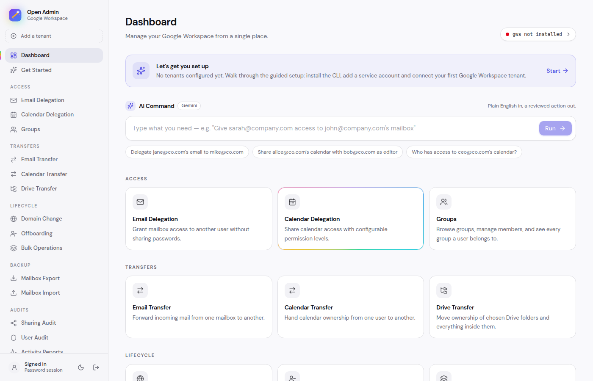

## ✨ What it does

### Workspace operations

- 📧 **Email Delegation** — Give someone access to another user's mailbox. No password sharing, no drama.
- 📅 **Calendar Delegation** — Share a calendar with configurable permissions (free/busy, read, edit, full control).
- 🔄 **Calendar Transfer** — Hand off calendar ownership to another user. Great for offboarding.
- 📬 **Email Transfer** — Set up auto-forwarding from one mailbox to another. External-domain transfers require explicit confirmation.
- 🌐 **Domain Change** — Switch a user's primary email to a different domain in your tenant. Server-side preflight + read-after-write verification.
- 👋 **Offboarding** — One screen, one click. Vacation responder, mail forwarding, calendar + Drive ownership transfer, OAuth token revocation, sign-out, and account suspension — in the right order, with full diff preview before anything fires.
- 💾 **Mailbox Export** — Back up a user's entire Gmail mailbox to a portable file. Choose **NDJSON** for a full-fidelity backup (raw MIME with labels and dates preserved, restorable via Mailbox Import) or **mbox** for a standard mailbox file you can open in Thunderbird, Apple Mail, or convert to PST. Walks the mailbox page by page, streams straight to disk, cancellable mid-run (you keep what's gathered).
- 📥 **Mailbox Import** — Restore a mailbox export into another user. Recreates the source's labels by name, then inserts every message via IMAP-style append (no re-delivery, no spam reclassification) with original dates intact — gated behind a typed confirmation since it writes into a live mailbox.
- 🔍 **External Sharing Audit** — Per-user or tenant-wide Drive scan that surfaces every file shared outside your verified domains, including link-shared / "anyone with link" content. Cancellable, progress-tracked, CSV export, and one-click "revoke external sharing" per file or in bulk — strips only external permissions, leaves internal collaborators alone.
- 🏢 **Multi-Tenant Support** — Configure multiple Google Workspace environments (Production, Sandbox, etc.) and switch between them instantly from the sidebar. Per-request tenant isolation — nothing carries over between tenants.

### AI-powered (Gemini)

- ✨ **AI Command** (right on the dashboard) — Type what you need in plain English. *"Give sarah access to john's mailbox"* → it parses the intent, validates the params, shows you what it'll do, and waits for your OK. No menu hunting, no extra clicks.
- 🛡️ **User Audit** — Enter a user's email and get a full AI-generated report: who has access to their mailbox, calendar sharing rules, forwarding config, and security flags.

### Safety & ops

- 🔐 **Password gate + signed sessions** — App refuses to serve any route without `APP_PASSWORD` (or `APP_SESSION_SECRET`) set. HMAC-signed session cookies, 12h TTL, rate-limited login.
- 🪪 **Single sign-on (OIDC)** — Plug in any OpenID Connect provider (Google, Microsoft Entra ID, Okta, Keycloak, Authentik...) and sign in through your IdP instead of a shared password. Authorization-code flow with PKCE, issuer discovery, email/domain allowlists, per-user attribution in the audit log, and an `SSO_RESCUE` escape hatch so a broken IdP can never lock you out.
- 🧭 **First-launch onboarding wizard** — A fresh install walks you through the whole setup on first login: CLI install, service account, first tenant, and SSO. Re-run it any time from **Get Started** in the sidebar.
- 💼 **Portable configuration** — Export everything — SSO settings, tenants, and the service-account key files themselves — to a single JSON bundle from **App Settings**, and restore it on another server in one click. Keys are written back to disk automatically (relocated if the original path doesn't exist there), with a preview first and a typed confirmation only when overwriting an already-configured server.
- 🛡️ **CSRF protection** — Same-origin Origin/Referer check on every mutating API route, validated against the canonical request host.
- ⚠️ **Confirmation dialogs** — Every destructive action (domain change, calendar transfer, external email transfer, offboarding, account suspension) shows a before→after diff and requires you to type the target email/identifier to confirm.
- 📜 **Audit log** — Append-only JSON-lines log of every mutation, with secrets redacted (`AUDIT_LOG_PATH` env var to control location).
- 🧪 **Atomic tenant config writes** — `tenants.json` is written via tmp-file + rename with an in-process mutex so a crash mid-write can't corrupt your config.

### Polish

- 🌗 **Dark mode** — Auto-detects your system preference, persists across reloads, one-click toggle in the sidebar.
- 🪟 **Cross-platform** — Tested on macOS, Linux, and Windows 11 (handles `gws.cmd` shim, CRLF line endings, AV-related file lock retries).

<details>
<summary>🌗 Dashboard in dark mode</summary>

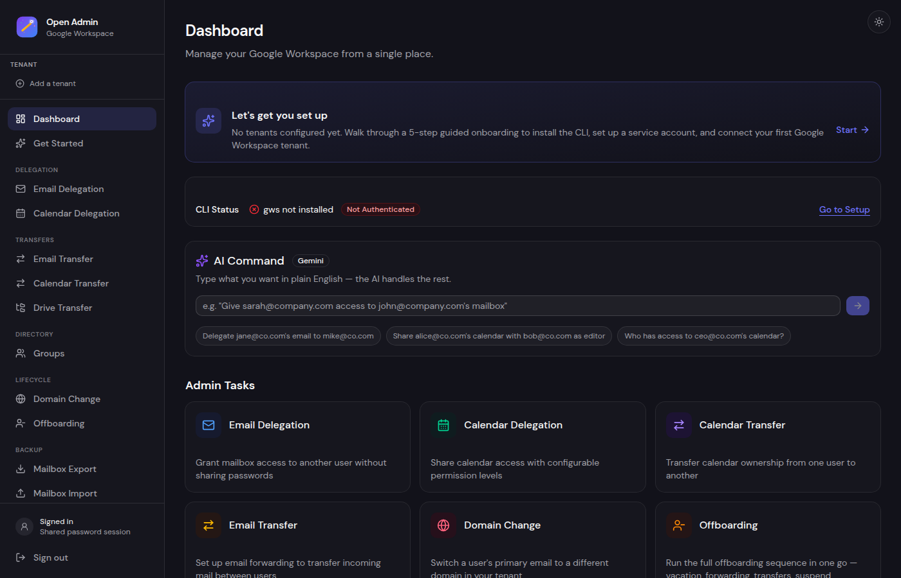

</details>

<details>
<summary>📸 More screenshots</summary>

### User Audit
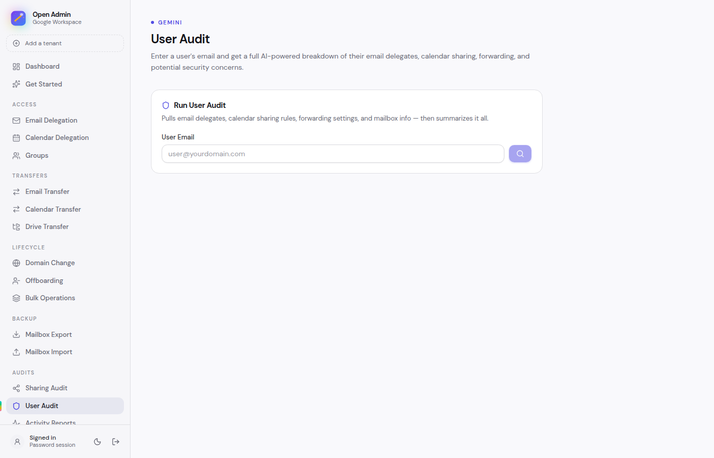

### Email Delegation
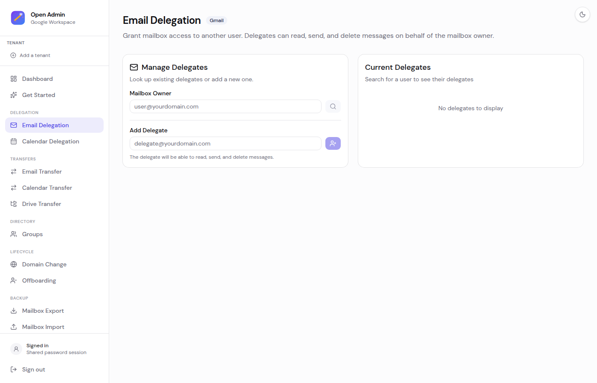

### Calendar Delegation
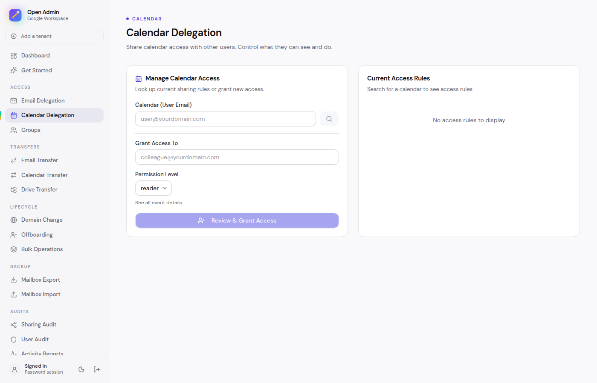

### Calendar Transfer
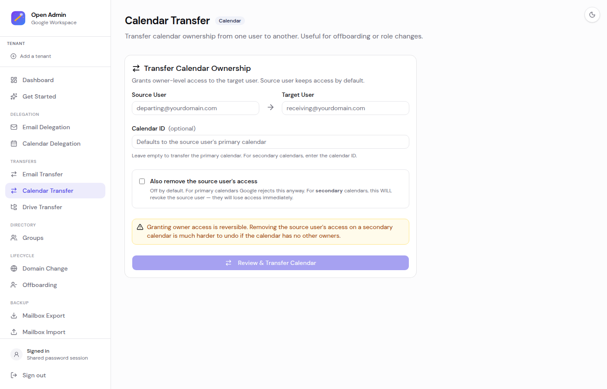

### Email Transfer
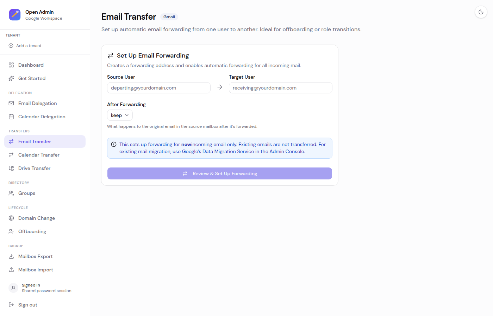

### Domain Change
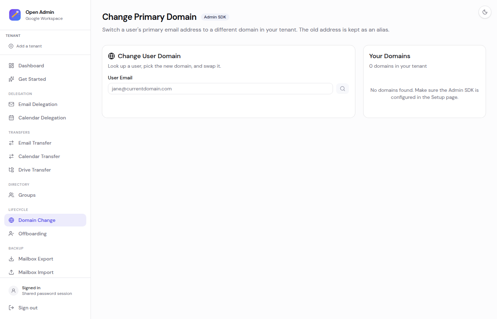

### Offboarding
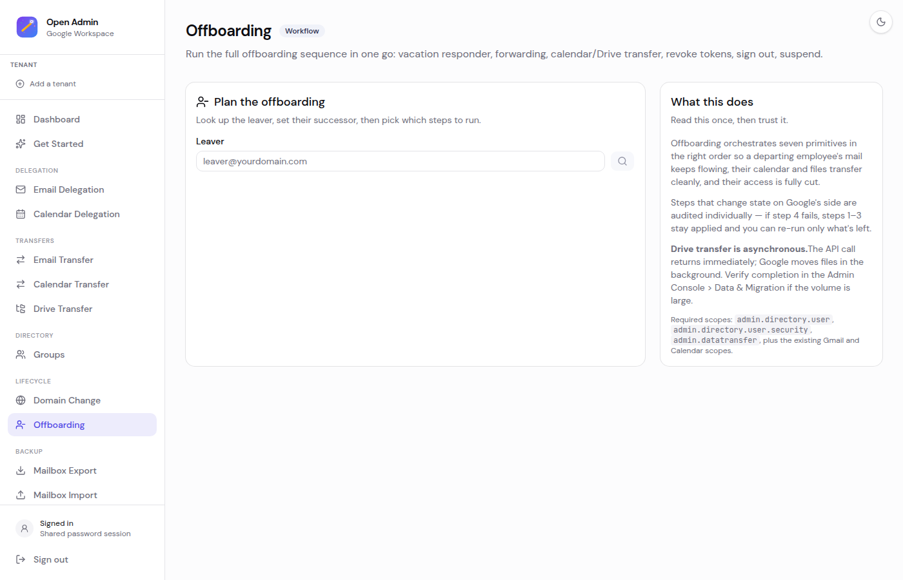

### External Sharing Audit
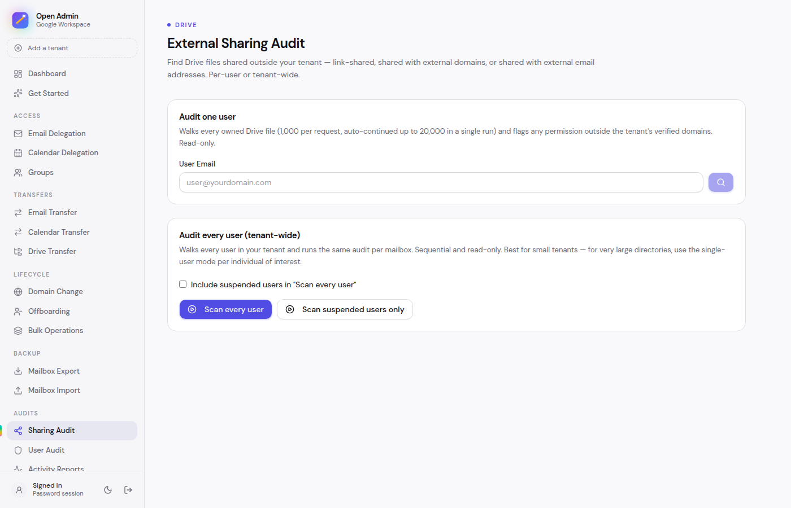

### Tenants
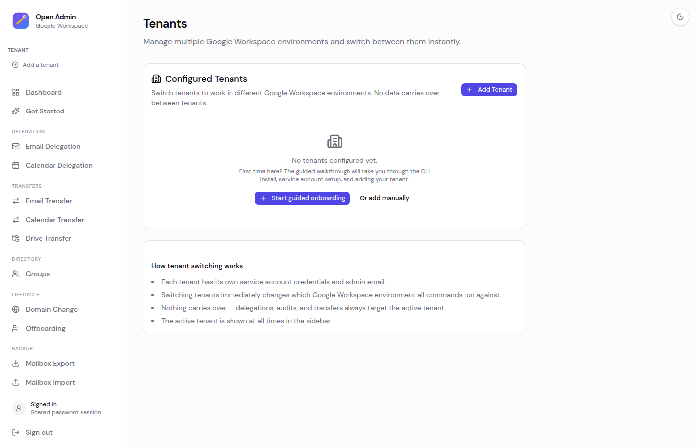

### Setup
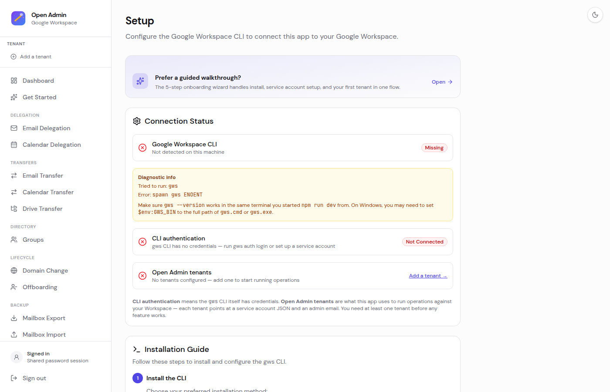

</details>

## 🚀 Getting started

You'll need:
- Node.js 18+
- The [gws CLI](https://github.com/googleworkspace/cli)
- A Google Workspace admin account

```bash
# Grab the gws CLI
npm install -g @googleworkspace/cli

# Auth up (easiest way, needs gcloud)
gws auth setup

# Or do it manually
gws auth login -s gmail,calendar

# Then run this thing
git clone https://github.com/Michael-Civitillo/google-workspace-ai-toolbox.git
cd google-workspace-ai-toolbox
npm install

# Required: set the password gate before starting the server
export APP_PASSWORD='something-long-and-random'

npm run dev
```

Hit [http://localhost:3000](http://localhost:3000), log in with your `APP_PASSWORD`, and you're in. 🎉

### 🪟 Windows 11 (PowerShell)

Same flow, just different env-var syntax. Open **PowerShell** (or Windows Terminal):

```powershell
# Install Node.js 18+ from https://nodejs.org and the gws CLI:
npm install -g @googleworkspace/cli

# Auth up
gws auth setup    # needs gcloud (winget install Google.CloudSDK)
# or:
gws auth login -s gmail,calendar

# Clone and install
git clone https://github.com/Michael-Civitillo/google-workspace-ai-toolbox.git
cd google-workspace-ai-toolbox
npm install

# Required: password gate (current PowerShell session only)
$env:APP_PASSWORD = "something-long-and-random"

# Optional: service-account / Gemini setup
$env:GOOGLE_WORKSPACE_ADMIN_EMAIL = "admin@yourdomain.com"
$env:GOOGLE_WORKSPACE_CLI_CREDENTIALS_FILE = "C:\path\to\service-account.json"
$env:GOOGLE_GENERATIVE_AI_API_KEY = "your-key-here"

# Fire it up
npm run dev
```

To make env vars persist across sessions, use the **Settings → System → About → Advanced system settings → Environment Variables** dialog, or run `setx APP_PASSWORD "..."` in PowerShell (closes/reopens the terminal to take effect).

If you'd rather use **Command Prompt** (`cmd.exe`), swap `$env:NAME = "value"` for `set NAME=value`. **Git Bash** uses the same `export NAME=value` syntax shown in the macOS/Linux instructions above.

## 🔐 Auth setup (the important part)

The app runs `gws` commands and `googleapis` SDK calls on the server side. For real admin work, you'll want a **service account with domain-wide delegation** so you can act on behalf of any user in your org:

1. Create a service account in your GCP project
2. Turn on domain-wide delegation in the Admin Console
3. Add these OAuth scopes:
   - `https://www.googleapis.com/auth/gmail.settings.sharing`
   - `https://www.googleapis.com/auth/gmail.settings.basic`
   - `https://www.googleapis.com/auth/gmail.readonly` (Mailbox Export)
   - `https://www.googleapis.com/auth/gmail.insert` (Mailbox Import)
   - `https://www.googleapis.com/auth/gmail.labels` (Mailbox Import — recreate labels)
   - `https://www.googleapis.com/auth/calendar`
   - `https://www.googleapis.com/auth/admin.directory.user` (Domain Change, Offboarding)
   - `https://www.googleapis.com/auth/admin.directory.user.security` (Offboarding — OAuth token revoke, sign-out)
   - `https://www.googleapis.com/auth/admin.directory.domain.readonly` (Domain Change, Sharing Audit)
   - `https://www.googleapis.com/auth/admin.datatransfer` (Offboarding — Drive ownership transfer)
   - `https://www.googleapis.com/auth/drive.metadata.readonly` (Sharing Audit)
   - `https://www.googleapis.com/auth/drive` (Sharing Audit — revoke external sharing)
4. Set an admin email for impersonation (Domain Change and Admin SDK calls need this):
   ```bash
   export GOOGLE_WORKSPACE_ADMIN_EMAIL=admin@yourdomain.com
   ```
5. Tell the CLI where to find your service account JSON:
   ```bash
   export GOOGLE_WORKSPACE_CLI_CREDENTIALS_FILE=/path/to/service-account.json
   ```

For the AI features, you'll also need a [Gemini API key](https://aistudio.google.com/apikey):
```bash
export GOOGLE_GENERATIVE_AI_API_KEY=your-key-here
```

> **Tip:** If you're using multi-tenant support, set credentials per tenant directly in the UI instead of relying on env vars.

## 🪪 Single sign-on (SSO via OIDC)

Out of the box the toolbox is gated by a shared `APP_PASSWORD`. For teams, wire it to your identity provider instead — any OpenID Connect provider works:

1. In your IdP, create an **OIDC web application** and register this redirect URI (shown with a copy button in the app too):
   ```
   https://<your-toolbox-host>/api/auth/sso/callback
   ```
2. Log in to the toolbox and open **App Settings → Single sign-on** (or the SSO step of the onboarding wizard). Paste the **issuer URL**, **client ID**, and **client secret**, hit **Test connection** to confirm discovery works, and save.
3. Lock down who gets in with the **allowed domains / allowed emails** lists. With both empty, anyone your IdP authenticates gets admin access — only do that if the IdP app itself is restricted.
4. Once SSO is proven working you can untick **Keep password login available** to retire the shared password form.

Issuer examples:

| Provider | Issuer URL |
|---|---|
| Google | `https://accounts.google.com` |
| Microsoft Entra ID | `https://login.microsoftonline.com/<tenant-id>/v2.0` |
| Okta | `https://<org>.okta.com` |
| Keycloak | `https://<host>/realms/<realm>` |

Details worth knowing:

- The flow is **authorization code + PKCE** with full state/nonce/ID-token validation (via the certified [openid-client](https://github.com/panva/openid-client) library). Plain-`http` issuers are only accepted on localhost.
- Behind a reverse proxy, set the **Public base URL** field so the redirect URI is derived from your canonical hostname instead of whatever the proxy forwards.
- SSO logins put the user's email into sessions and the audit log, so actions become attributable per admin instead of "whoever had the password".
- **Locked out because SSO broke?** Set `SSO_RESCUE=true` in the server environment and restart — the password form comes back regardless of settings. Fix the IdP config, then unset it.
- Want to drop the shared password entirely? Set a high-entropy `APP_SESSION_SECRET`, confirm SSO works, then unset `APP_PASSWORD`. (You need `APP_PASSWORD` for the very first login, before SSO exists.)

## 💼 Moving servers: configuration export / import

**App Settings → Configuration backup** exports the whole setup as one JSON bundle, and restores it on any other instance. Back up: click **Download config bundle**. Restore: install the app, log in, pick the file, click **Restore**. That's it.

- The bundle contains everything: SSO settings (client secret included), every tenant with its Gemini key, and the **service-account JSON key files themselves** — so the restore needs no side-channel key copying. Treat the file like a password.
- On import, key files are written back to their original paths. If a path doesn't work on the new machine (different OS or layout, e.g. a Windows export restored onto Linux, or outside `GWS_CREDENTIALS_DIR`), the key is relocated — into `GWS_CREDENTIALS_DIR` if set, else `./credentials/` — and the tenant re-pointed automatically. An existing different file at a target path is kept as a `.bak`, never destroyed.
- Import **replaces** the target server's SSO settings and tenant list (it's a restore, not a merge) and previews what's inside first. On a fresh server it's a single click; overwriting an already-configured server asks you to type `REPLACE`.
- Untick **Include secrets** to export a sanitised copy (no secrets, no key files) for sharing a config layout.
- The onboarding wizard's final step offers the same export, so a fresh setup ends with a backup in hand.

## 🔒 Production deployment

The toolbox is designed to be safe to run against a real tenant, but a few env vars matter:

| Variable | Required | What it does |
|---|---|---|
| `APP_PASSWORD` | ✅ (unless SSO-only, see below) | Password gate. App refuses to serve any route without it (or `APP_SESSION_SECRET`). |
| `APP_SESSION_SECRET` | recommended | Dedicated high-entropy session-signing secret. Required if you drop `APP_PASSWORD` for an SSO-only deployment. |
| `SSO_RESCUE` | optional | `true` forces password login back on if a broken SSO config locked you out. |
| `GOOGLE_WORKSPACE_ADMIN_EMAIL` | ✅ for Admin SDK ops | Subject for service account impersonation. |
| `GOOGLE_WORKSPACE_CLI_CREDENTIALS_FILE` | ⚠️ if not using per-tenant config | Path to service account JSON. |
| `GOOGLE_GENERATIVE_AI_API_KEY` | ⚠️ for AI features | Gemini API key. |
| `AUDIT_LOG_PATH` | optional | Override location of the append-only audit log (defaults to `./audit.log`). |
| `GWS_CREDENTIALS_DIR` | optional | Allowlist a directory; tenant credential paths must live underneath it. |

App-level settings configured in the UI (SSO, onboarding state) are stored in `app-config.json` next to `tenants.json` — both gitignored, both written atomically, both covered by the configuration export.

Run behind HTTPS in production. The app sets HSTS, X-Frame-Options, X-Content-Type-Options, and Referrer-Policy on every response.

## 🏢 Multiple tenants (Production, Sandbox, etc.)

Got more than one Workspace environment? Go to **Tenants** in the sidebar and add each one with its own service account and admin email. The active tenant is always visible in the sidebar — switch between them with one click.

Each tenant is fully isolated: every command, delegation, audit, and transfer targets whichever tenant is active at the time. The active tenant ID is sent on every request via an `x-tenant-id` header and frozen at confirmation time, so a tenant switch mid-action can't accidentally fire against the wrong environment.

Tenant config is saved to `tenants.json` locally (gitignored — your credential paths stay on your machine).

## 🧰 Built with

- [Next.js](https://nextjs.org/) 16 (App Router)
- [Tailwind CSS](https://tailwindcss.com/) v4
- [shadcn/ui](https://ui.shadcn.com/) + [@base-ui/react](https://base-ui.com/)
- [Vercel AI SDK](https://sdk.vercel.ai/) + [Gemini](https://ai.google.dev/)
- [googleapis](https://www.npmjs.com/package/googleapis) — direct Gmail, Calendar, Admin SDK, Drive, and Data Transfer calls (no CLI hop, fewer args quirks)
- [gws CLI](https://github.com/googleworkspace/cli) — used for everything outside the Google APIs we wrap directly
- Web Crypto API (Edge-runtime safe HMAC sessions)

## 💻 Dev stuff

```bash
npm run dev          # fire it up
npm run build        # production build
npm run lint         # check your work
npm run screenshots  # regenerate docs/screenshots/* in light + dark modes (needs dev server + APP_PASSWORD)
```

## ⚠️ Heads up

This tool makes real changes to real Google Workspace accounts. Mistakes can lock people out, break email routing, or cause other headaches that are annoying to undo. Use it carefully, test in a sandbox first, and make sure whoever's running it knows what they're doing.

**This is provided as-is. No warranty, no guarantees, not my problem if something goes wrong.** You're responsible for what you do with it.

## 📄 License

MIT — do whatever you want with it.
