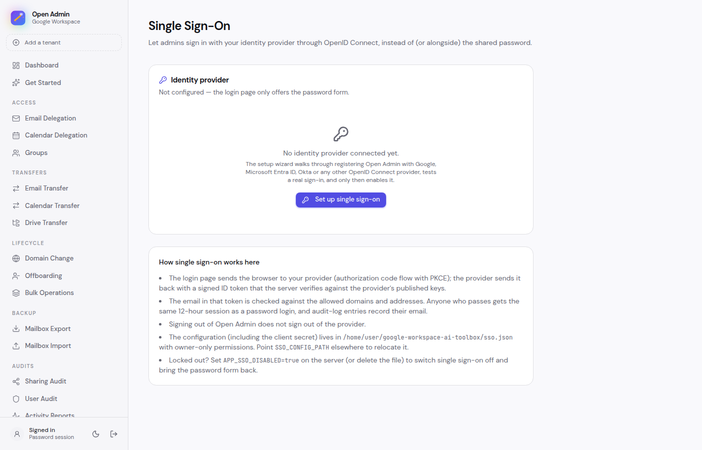

<p align="left">
  
</p>

<h1 align="left">Google Workspace Open Admin</h1>

<p align="left">
  <strong>If you grew up on <a href="https://github.com/GAM-team/GAM">GAM</a>, this is what comes next.</strong><br/>
  A modern web UI for Google Workspace admin tasks — powered by Google's official <a href="https://github.com/googleworkspace/cli">Workspace CLI</a> and Gemini AI.
</p>

For years, [GAM](https://github.com/GAM-team/GAM) was *the* tool every Workspace admin had in their back pocket. It's a legend. But now Google has released their own [Workspace CLI](https://github.com/googleworkspace/cli) (`gws`) — built in Rust, schema-driven, officially maintained — and suddenly we've got a proper foundation to build on.

This project takes `gws` and wraps it in a clean web UI with AI superpowers. Instead of memorizing command flags or digging through the Admin Console, just type what you need in plain English, paste a bulk list, or click through the forms. It's GAM for the AI era.


## ✨ What it does

### Workspace operations

- 📧 **Email Delegation** — Give someone access to another user's mailbox. No password sharing, no drama.
- 📅 **Calendar Delegation** — Share a calendar with configurable permissions (free/busy, read, edit, full control).
- 🔄 **Calendar Transfer** — Hand off calendar ownership to another user. Great for offboarding.
- 📬 **Email Transfer** — Set up auto-forwarding from one mailbox to another. External-domain transfers require explicit confirmation.
- 🌐 **Domain Change** — Switch a user's primary email to a different domain in your tenant. Server-side preflight + read-after-write verification.
- 👋 **Offboarding** — One screen, one click. Vacation responder, mail forwarding, calendar + Drive ownership transfer, OAuth token revocation, sign-out, and account suspension — in the right order, with full diff preview before anything fires.
- 💾 **Mailbox Export** — Back up a user's entire Gmail mailbox to a portable file. Choose **NDJSON** for a full-fidelity backup (raw MIME with labels and dates preserved, restorable via Mailbox Import) or **mbox** for a standard mailbox file you can open in Thunderbird, Apple Mail, or convert to PST. Walks the mailbox page by page, streams straight to disk, cancellable mid-run (you keep what's gathered).
- 📥 **Mailbox Import** — Restore a mailbox export into another user. Recreates the source's labels by name, then inserts every message via IMAP-style append (no re-delivery, no spam reclassification) with original dates intact — gated behind a typed confirmation since it writes into a live mailbox.
- 🔍 **External Sharing Audit** — Per-user or tenant-wide Drive scan that surfaces every file shared outside your verified domains, including link-shared / "anyone with link" content. Cancellable, progress-tracked, CSV export, and one-click "revoke external sharing" per file or in bulk — strips only external permissions, leaves internal collaborators alone.
- 🏢 **Multi-Tenant Support** — Configure multiple Google Workspace environments (Production, Sandbox, etc.) and switch between them instantly from the sidebar. Per-request tenant isolation — nothing carries over between tenants.

### AI-powered (Gemini)

- ✨ **AI Command** (right on the dashboard) — Type what you need in plain English. *"Give sarah access to john's mailbox"* → it parses the intent, validates the params, shows you what it'll do, and waits for your OK. No menu hunting, no extra clicks.
- 🛡️ **User Audit** — Enter a user's email and get a full AI-generated report: who has access to their mailbox, calendar sharing rules, forwarding config, and security flags.

### Safety & ops

- 🔐 **Password gate + signed sessions** — App refuses to serve any route without `APP_PASSWORD` set. HMAC-signed session cookies, 12h TTL, rate-limited login.
- 🔑 **Single sign-on (OIDC)** — Sign in with Google, Microsoft Entra ID, Okta, or any OpenID Connect provider instead of (or alongside) the shared password. A pop-up wizard registers the app, checks the issuer, runs a real test sign-in, and only then enables it. Allowlist by domain or email; sessions and audit entries record who signed in.
- 🧭 **First-launch onboarding** — A fresh install takes you straight to the guided setup on first login: CLI install, service account, first tenant, single sign-on. Skip it or re-run it any time from **Get Started** in the sidebar.
- 💼 **Portable configuration** — Export everything — single sign-on settings, tenants, and the service-account key files themselves — to one JSON bundle from **App Settings**, and restore it on another server in one click. Keys are written back to disk automatically (relocated if the original path doesn't exist there), with a preview first and a typed confirmation only when overwriting an already-configured server.
- 🛡️ **CSRF protection** — Same-origin Origin/Referer check on every mutating API route, validated against the canonical request host.
- ⚠️ **Confirmation dialogs** — Every destructive action (domain change, calendar transfer, external email transfer, offboarding, account suspension) shows a before→after diff and requires you to type the target email/identifier to confirm.
- 📜 **Audit log** — Append-only JSON-lines log of every mutation, with secrets redacted (`AUDIT_LOG_PATH` env var to control location).
- 🧪 **Atomic config writes** — `tenants.json`, `sso.json` and `app-config.json` share one store implementation: tmp-file + fsync + rename with an in-process mutex, so a crash mid-write can't corrupt your config.

### Polish

- 🌗 **Dark mode** — Auto-detects your system preference, persists across reloads, one-click toggle in the sidebar.
- 🪟 **Cross-platform** — Tested on macOS, Linux, and Windows 11 (handles `gws.cmd` shim, CRLF line endings, AV-related file lock retries).

<details>
<summary>🌗 Dashboard in dark mode</summary>


</details>

<details>
<summary>📸 More screenshots</summary>

### User Audit


### Email Delegation


### Calendar Delegation


### Calendar Transfer


### Email Transfer


### Domain Change


### Offboarding


### External Sharing Audit


### Tenants


### Setup


### Single Sign-On


</details>

## ⬇️ Pick how you want to run it

Same app, same features. Choose what suits you and the machine it's on:

| | Windows | macOS | Linux |
|---|---|---|---|
| **Single file, nothing to install** | ✅ `OpenAdmin-win-x64.exe` | ✅ `open-admin-macos-arm64` (Apple silicon) | ✅ `open-admin-linux-x64` |
| **From source** — `npm run dev` / `npm start` | ✅ | ✅ | ✅ |
| **Docker** — `Dockerfile` in the repo | ✅ Docker Desktop | ✅ Docker Desktop | ✅ |
| **For a team, behind Cloudflare Tunnel + Access** | any of the above → [deployment guide](docs/DEPLOY-CLOUDFLARE.md) | | |

Your configuration moves between all of them: **App Settings → Configuration backup** exports tenants, single sign-on and the service-account keys as one file, and restores it anywhere. Intel Macs: run from source or Docker for now.

### Single file: download and run

Grab the file for your OS from the [latest release](https://github.com/Michael-Civitillo/google-workspace-ai-toolbox/releases/latest). Each has a `.sha256` next to it if you want to verify the download.

**Windows** — double-click `OpenAdmin-win-x64.exe`. Windows may show "Windows protected your PC" for a new download: click **More info → Run anyway**.

**macOS** (Apple silicon) — in Terminal:

```bash
chmod +x ~/Downloads/open-admin-macos-arm64
xattr -d com.apple.quarantine ~/Downloads/open-admin-macos-arm64
~/Downloads/open-admin-macos-arm64
```

The build is signed ad hoc rather than notarised, so without the `xattr` line macOS refuses it ("Apple could not verify…"). Allowing it under **System Settings → Privacy & Security → Open Anyway** works too.

**Linux** (x86-64) —

```bash
chmod +x ~/Downloads/open-admin-linux-x64
~/Downloads/open-admin-linux-x64
```

Then, on every OS: choose a password when asked, and your browser opens at `http://localhost:3000`. Sign in and you're in. 🎉

Everything is inside that one file — the runtime, the app, the lot. No Node.js, no `npm install`, no `gws` CLI. It serves **this machine only**: the server listens on loopback, so nothing is exposed to your network and no firewall prompts. You still need a **service account with domain-wide delegation** before you can run operations — the app walks you through it on first launch ([Auth setup](#-auth-setup-the-important-part)).

**Where things live**

| | The app (disposable, replaced on upgrade) | Your data |
|---|---|---|
| Windows | `%LOCALAPPDATA%\GoogleWorkspaceOpenAdmin\app\` | `%LOCALAPPDATA%\GoogleWorkspaceOpenAdmin\data\` |
| macOS | `~/Library/Application Support/GoogleWorkspaceOpenAdmin/app/` | `…/GoogleWorkspaceOpenAdmin/data/` |
| Linux | `~/.local/share/GoogleWorkspaceOpenAdmin/app/` | `…/GoogleWorkspaceOpenAdmin/data/` |

**Upgrading:** download the new file and run it — your data is untouched and the old copy of the app is cleaned up. **Uninstalling:** delete the file and the `GoogleWorkspaceOpenAdmin` folder. **Stopping:** Ctrl+C in the console, or close it.

<details>
<summary>Command-line options and extras</summary>

```
open-admin [options]

  --port <n>           HTTP port (default 3000, remembered after first use)
  --host <addr>        bind address (default 127.0.0.1 — this machine only)
  --data-dir <path>    where tenants, sign-on config, audit log and keys live
  --root <path>        override the whole application folder (app cache + data)
  --set-password       set a new admin password for the web UI
  --password <pw>      admin password for this run only
  --no-browser         don't open a browser window on start
  --reset-app-cache    re-extract the bundled application files
  --version, -v        print version information
  --help, -h           show this help
```

**Portable mode.** Create an empty file called `portable.txt` next to the executable and it keeps everything beside itself instead of in your user profile — handy for a USB stick or a locked-down machine.

**Extra settings.** Optional keys like a Gemini API key can go in a `launcher.env` file in the data folder (`KEY=value`, one per line), so you never touch system environment variables. Real environment variables win over that file. This is also where `APP_ALLOWED_ORIGINS` goes if you put the single-file build behind a [Cloudflare Tunnel](docs/DEPLOY-CLOUDFLARE.md).

**Changing the port** changes the sign-in URL, so update the redirect URI in your identity provider if you use single sign-on.

</details>

Building it yourself, or wondering how it works: [`packaging/README.md`](packaging/README.md).

### Docker

```bash
docker build -t open-admin .
docker run -d --name open-admin -p 3000:3000 -v open-admin-data:/data \
  -e APP_PASSWORD='something-long-and-random' open-admin
```

Open [http://localhost:3000](http://localhost:3000). State lives in the `open-admin-data` volume. To serve it under a real hostname, set `APP_ALLOWED_ORIGINS=https://admin.example.com` and put a proxy in front — the [Cloudflare guide](docs/DEPLOY-CLOUDFLARE.md) ships a ready-made Compose file with `cloudflared` alongside.

### From source

Everything below. Same commands on Windows, macOS and Linux.

## 🚀 Getting started

For development, or when you'd rather have the code in front of you.

You'll need:
- Node.js 20+
- The [gws CLI](https://github.com/googleworkspace/cli)
- A Google Workspace admin account

```bash
# Grab the gws CLI
npm install -g @googleworkspace/cli

# Auth up (easiest way, needs gcloud)
gws auth setup

# Or do it manually
gws auth login -s gmail,calendar

# Then run this thing
git clone https://github.com/Michael-Civitillo/google-workspace-ai-toolbox.git
cd google-workspace-ai-toolbox
npm install

# Required: set the password gate before starting the server
export APP_PASSWORD='something-long-and-random'

npm run dev
```

Hit [http://localhost:3000](http://localhost:3000), log in with your `APP_PASSWORD`, and you're in. 🎉

### 🪟 Windows 11 (PowerShell)

Same flow, just different env-var syntax. Open **PowerShell** (or Windows Terminal):

```powershell
# Install Node.js 20+ from https://nodejs.org and the gws CLI:
npm install -g @googleworkspace/cli

# Auth up
gws auth setup    # needs gcloud (winget install Google.CloudSDK)
# or:
gws auth login -s gmail,calendar

# Clone and install
git clone https://github.com/Michael-Civitillo/google-workspace-ai-toolbox.git
cd google-workspace-ai-toolbox
npm install

# Required: password gate (current PowerShell session only)
$env:APP_PASSWORD = "something-long-and-random"

# Optional: service-account / Gemini setup
$env:GOOGLE_WORKSPACE_ADMIN_EMAIL = "admin@yourdomain.com"
$env:GOOGLE_WORKSPACE_CLI_CREDENTIALS_FILE = "C:\path\to\service-account.json"
$env:GOOGLE_GENERATIVE_AI_API_KEY = "your-key-here"

# Fire it up
npm run dev
```

To make env vars persist across sessions, use the **Settings → System → About → Advanced system settings → Environment Variables** dialog, or run `setx APP_PASSWORD "..."` in PowerShell (closes/reopens the terminal to take effect).

If you'd rather use **Command Prompt** (`cmd.exe`), swap `$env:NAME = "value"` for `set NAME=value`. **Git Bash** uses the same `export NAME=value` syntax shown in the macOS/Linux instructions above.

## 🔐 Auth setup (the important part)

The app runs `gws` commands and `googleapis` SDK calls on the server side. For real admin work, you'll want a **service account with domain-wide delegation** so you can act on behalf of any user in your org:

1. Create a service account in your GCP project
2. Turn on domain-wide delegation in the Admin Console
3. Add these OAuth scopes:
   - `https://www.googleapis.com/auth/gmail.settings.sharing`
   - `https://www.googleapis.com/auth/gmail.settings.basic`
   - `https://www.googleapis.com/auth/gmail.readonly` (Mailbox Export)
   - `https://www.googleapis.com/auth/gmail.insert` (Mailbox Import)
   - `https://www.googleapis.com/auth/gmail.labels` (Mailbox Import — recreate labels)
   - `https://www.googleapis.com/auth/calendar`
   - `https://www.googleapis.com/auth/admin.directory.user` (Domain Change, Offboarding)
   - `https://www.googleapis.com/auth/admin.directory.user.security` (Offboarding — OAuth token revoke, sign-out)
   - `https://www.googleapis.com/auth/admin.directory.domain.readonly` (Domain Change, Sharing Audit)
   - `https://www.googleapis.com/auth/admin.datatransfer` (Offboarding — Drive ownership transfer)
   - `https://www.googleapis.com/auth/drive.metadata.readonly` (Sharing Audit)
   - `https://www.googleapis.com/auth/drive` (Sharing Audit — revoke external sharing)
4. Set an admin email for impersonation (Domain Change and Admin SDK calls need this):
   ```bash
   export GOOGLE_WORKSPACE_ADMIN_EMAIL=admin@yourdomain.com
   ```
5. Tell the CLI where to find your service account JSON:
   ```bash
   export GOOGLE_WORKSPACE_CLI_CREDENTIALS_FILE=/path/to/service-account.json
   ```

For the AI features, you'll also need a [Gemini API key](https://aistudio.google.com/apikey):
```bash
export GOOGLE_GENERATIVE_AI_API_KEY=your-key-here
```

> **Tip:** If you're using multi-tenant support, set credentials per tenant directly in the UI instead of relying on env vars.

## 🔒 Production deployment

Open Admin is designed to be safe to run against a real tenant, but a few env vars matter:

| Variable | Required | What it does |
|---|---|---|
| `APP_PASSWORD` | ✅ | Password gate. App refuses to serve any route without it. |
| `GOOGLE_WORKSPACE_ADMIN_EMAIL` | ✅ for Admin SDK ops | Subject for service account impersonation. |
| `GOOGLE_WORKSPACE_CLI_CREDENTIALS_FILE` | ⚠️ if not using per-tenant config | Path to service account JSON. |
| `GOOGLE_GENERATIVE_AI_API_KEY` | ⚠️ for AI features | Gemini API key. |
| `APP_ALLOWED_ORIGINS` | ✅ behind a proxy | Comma-separated public origin(s) browsers use, e.g. `https://admin.example.com`. Behind Cloudflare Tunnel, nginx or Docker with a hostname the browser's `Origin` is the public URL while the server only knows the address it bound — without this every mutating request is refused (403). |
| `TRUSTED_PROXY` | optional | Set to `true` when nothing but a trusted proxy can reach the app; per-address login rate limiting then reads `X-Forwarded-For`. |
| `OPEN_ADMIN_DATA_DIR` | optional | Where `tenants.json`, `app-config.json`, `sso.json`, `audit.log` and imported keys are kept (defaults to the working directory). The packaged Windows build sets this to your user profile. |
| `AUDIT_LOG_PATH` | optional | Override location of the append-only audit log (defaults to `./audit.log`). |
| `GWS_CREDENTIALS_DIR` | optional | Allowlist a directory; tenant credential paths must live underneath it. |
| `SSO_CONFIG_PATH` | optional | Override location of the single sign-on config (defaults to `./sso.json`). |
| `APP_SSO_DISABLED` | optional | Set to `true` to switch single sign-on off and restore password login without editing `sso.json`. |

State configured in the UI lives next to `tenants.json`: `sso.json` (single sign-on, mode 0600) and `app-config.json` (onboarding state) — all gitignored, all written atomically, all covered by the configuration export below.

Run behind HTTPS in production. The app sets HSTS, X-Frame-Options, X-Content-Type-Options, and Referrer-Policy on every response.

> **Behind a reverse proxy?** Set `APP_ALLOWED_ORIGINS` to the URL people type
> (`https://admin.example.com`). The CSRF check compares the browser's `Origin`
> against the address the server bound, which behind a proxy is never the
> public name — so without it every POST, sign-in included, is refused with 403.
> Step-by-step for Cloudflare Tunnel + Access, including a Docker Compose file:
> [docs/DEPLOY-CLOUDFLARE.md](docs/DEPLOY-CLOUDFLARE.md).

## 🔑 Single sign-on (OIDC)

The shared `APP_PASSWORD` is fine for one admin on a laptop. For a team, connect your identity provider instead: **Single Sign-On** in the sidebar opens a pop-up wizard that walks through the whole thing.

1. **Provider** — Google Workspace, Microsoft Entra ID, Okta, or any other OpenID Connect provider (Auth0, Keycloak, JumpCloud, …).
2. **Register app** — provider-specific instructions plus the exact redirect URI to paste in (`<base URL>/api/auth/oidc/callback`).
3. **Credentials** — issuer URL, client ID, client secret. *Check issuer* fetches the provider's discovery document from the server, so you know the endpoints are reachable before anything is saved.
4. **Who can sign in** — allowed email domains and/or addresses (mandatory for Google, since any Google account can complete the handshake). Keep the password form as a fallback (default) or turn it off.
5. **Test & enable** — save (stored disabled), run a real sign-in in a pop-up and see the email, name and access decision that came back, then enable. Turning the password form off requires a passing test first.

Under the hood: authorization code flow with PKCE; the ID token's signature, issuer, audience, expiry and nonce are verified via [openid-client](https://github.com/panva/openid-client); the `email` claim (or `preferred_username` / `upn` for Entra ID) is checked against the allowlist; an allowed account gets the same 12-hour signed session as a password login, and audit-log entries (`auth.sso_login`, `auth.sso_test`, `auth.sso_config.save`, …) record who did what.

The configuration — including the client secret — lives in `sso.json` (gitignored, mode 0600, next to `tenants.json`; relocate it with `SSO_CONFIG_PATH`). Locked out because the provider is down or misconfigured? Set `APP_SSO_DISABLED=true` on the server (or delete `sso.json`) and the password form comes back.

## 💼 Moving servers: configuration export / import

**App Settings → Configuration backup** exports the whole setup as one JSON bundle, and restores it on any other instance. Back up: click **Download config bundle**. Restore: install the app, log in, pick the file, click **Restore**. That's it.

- The bundle contains everything: single sign-on settings (client secret included), every tenant with its Gemini key, and the **service-account JSON key files themselves** — so the restore needs no side-channel key copying. Treat the file like a password.
- On import, key files are written back to their original paths. If a path doesn't work on the new machine (different OS or layout, e.g. a Windows export restored onto Linux, or outside `GWS_CREDENTIALS_DIR`), the key is relocated — into `GWS_CREDENTIALS_DIR` if set, else `./credentials/` — and the tenant re-pointed automatically. An existing different file at a target path is kept as a `.bak`, never destroyed.
- Import **replaces** the target server's single sign-on settings and tenant list (it's a restore, not a merge) and previews what's inside first. On a fresh server it's a single click; overwriting an already-configured server asks you to type `REPLACE`.
- A restored single sign-on configuration keeps the password form on until it passes a test sign-in on the new server, so a bundle can never lock you out. A bundle exported without secrets can't restore single sign-on at all (the settings are skipped with a warning) unless the server already holds the same client's secret.
- Untick **Include secrets** to export a sanitised copy (no secrets, no key files) for sharing a config layout.
- The onboarding wizard's final step offers the same export, so a fresh setup ends with a backup in hand.

## 🏢 Multiple tenants (Production, Sandbox, etc.)

Got more than one Workspace environment? Go to **Tenants** in the sidebar and add each one with its own service account and admin email. The active tenant is always visible in the sidebar — switch between them with one click.

Each tenant is fully isolated: every command, delegation, audit, and transfer targets whichever tenant is active at the time. The active tenant ID is sent on every request via an `x-tenant-id` header and frozen at confirmation time, so a tenant switch mid-action can't accidentally fire against the wrong environment.

Tenant config is saved to `tenants.json` locally (gitignored — your credential paths stay on your machine).

## 🧰 Built with

- [Next.js](https://nextjs.org/) 16 (App Router)
- [Tailwind CSS](https://tailwindcss.com/) v4
- [shadcn/ui](https://ui.shadcn.com/) + [@base-ui/react](https://base-ui.com/)
- [Vercel AI SDK](https://sdk.vercel.ai/) + [Gemini](https://ai.google.dev/)
- [googleapis](https://www.npmjs.com/package/googleapis) — direct Gmail, Calendar, Admin SDK, Drive, and Data Transfer calls (no CLI hop, fewer args quirks)
- [gws CLI](https://github.com/googleworkspace/cli) — used for everything outside the Google APIs we wrap directly
- Web Crypto API (Edge-runtime safe HMAC sessions)
- [openid-client](https://github.com/panva/openid-client) — OpenID Connect relying party (discovery, PKCE, ID token validation) for single sign-on

## 💻 Dev stuff

```bash
npm run dev            # fire it up
npm run build          # production build
npm run lint           # check your work
npm run screenshots    # regenerate docs/screenshots/* in light + dark modes (needs dev server + APP_PASSWORD)

npm run package        # build the single-file desktop payload (needs Node 22+)
npm run package:exe    # Windows: assemble OpenAdmin-win-x64.exe
npm run package:bin    # Linux/macOS: assemble packaging/dist/open-admin
npm run package:smoke  # start a built binary and check it end to end
npm run test:launcher  # unit tests for the packaged launcher
```

See [`packaging/README.md`](packaging/README.md) for how the single-file build
is put together.

## ⚠️ Heads up

This tool makes real changes to real Google Workspace accounts. Mistakes can lock people out, break email routing, or cause other headaches that are annoying to undo. Use it carefully, test in a sandbox first, and make sure whoever's running it knows what they're doing.

**This is provided as-is. No warranty, no guarantees, not my problem if something goes wrong.** You're responsible for what you do with it.

## 📄 License

MIT — do whatever you want with it.
